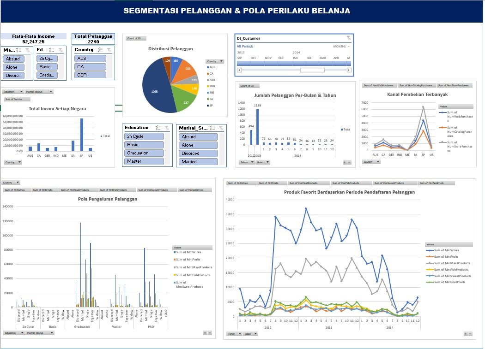

# marketing-customer-analysis-dashboard
Repository ini berisi analisis data marketing pelanggan yang bertujuan untuk
memahami segmentasi pelanggan dan pola perilaku belanja berdasarkan data demografis,
geografis, dan waktu pendaftaran pelanggan.

## Fitur Analisis
- Jumlah pelanggan & rata-rata pendapatan (Average Income)
- Distribusi pelanggan berdasarkan Country, Education, dan Marital Status
- Total pendapatan per negara
- Pola pengeluaran tiap produk berdasarkan Education & Marital Status, dengan filter Country
- Kanal pembelian terbanyak di setiap negara
- Tren pendaftaran pelanggan per bulan dan tahun
- Produk favorit berdasarkan periode pendaftaran pelanggan

## Tools
- Microsoft Excel (Pivot Table & Dashboard)
- Data Visualization
   

